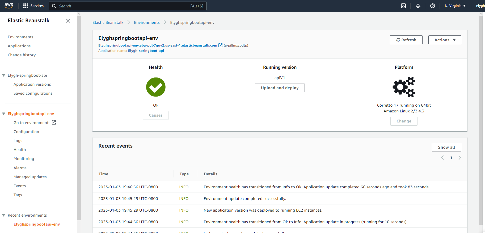
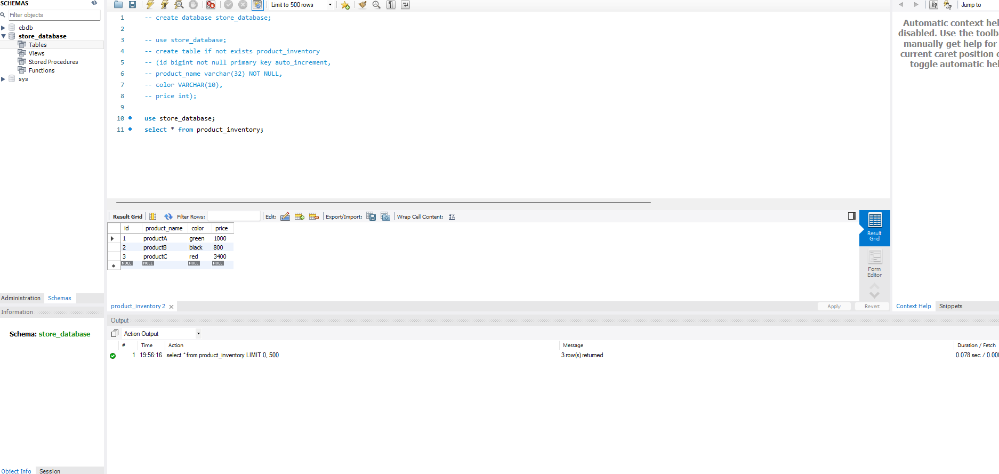
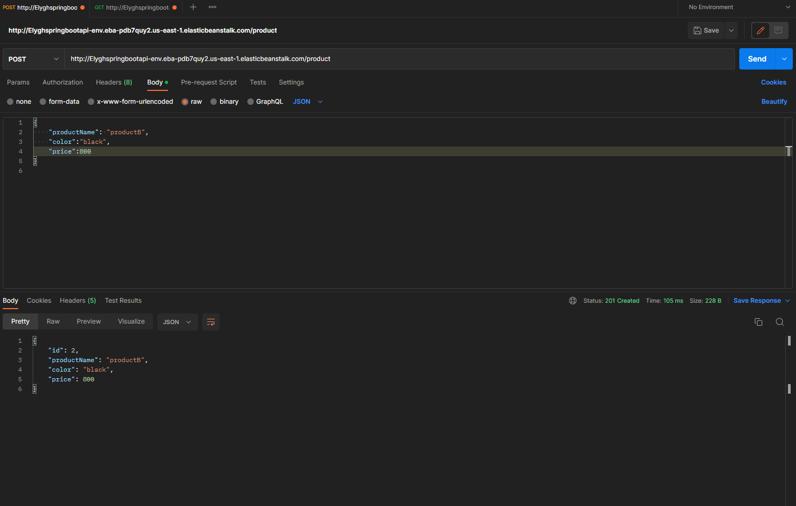
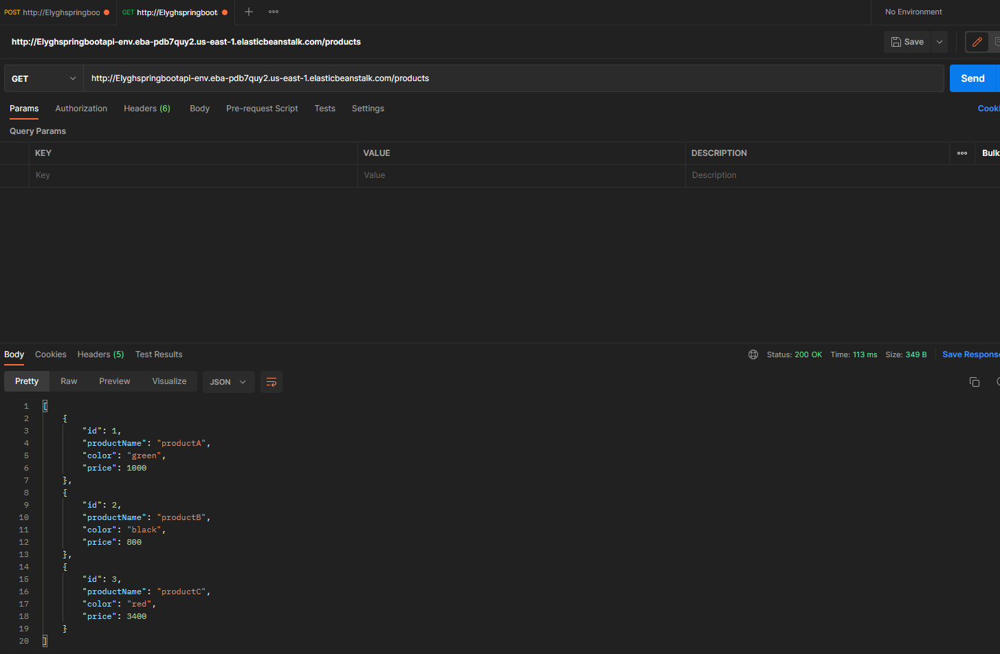
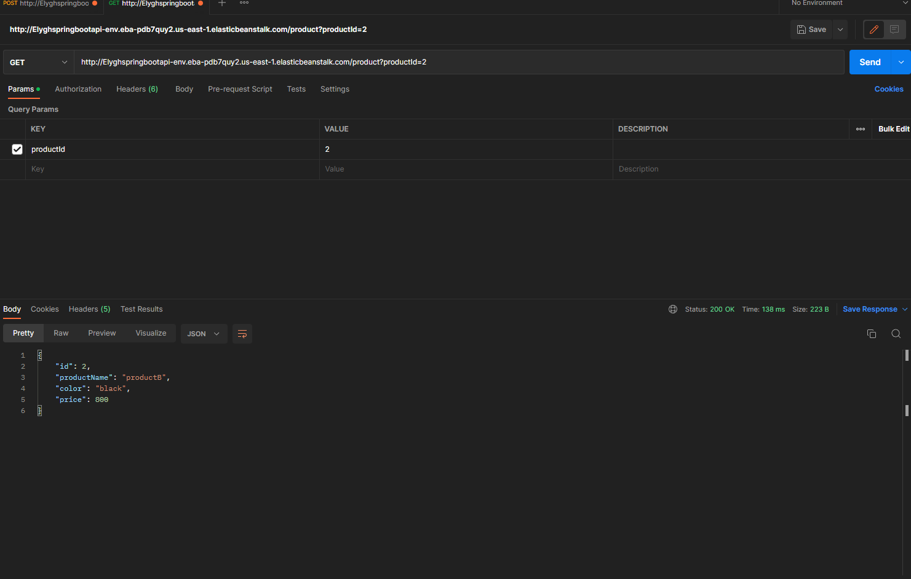

# Java Spring Boot CRUD API Project
Java application allowing access to mysql table hosted on AWS Elastic Beanstalk and RDS. Built using Lombok and Spring Framework libraries. 

# Features
* Features different endpoint access points allowing CRUD functionalities.
* Using Postman, allows access to api. 
* MySql data features name, price, color, and id

### test

### test

### test

### test

### test

